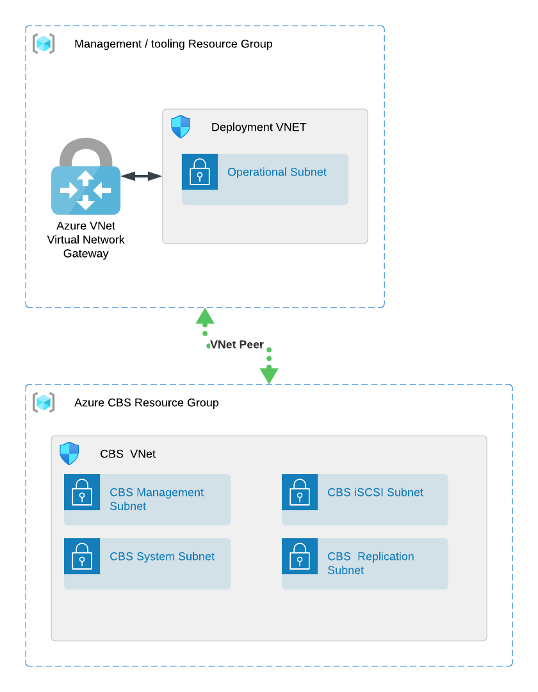
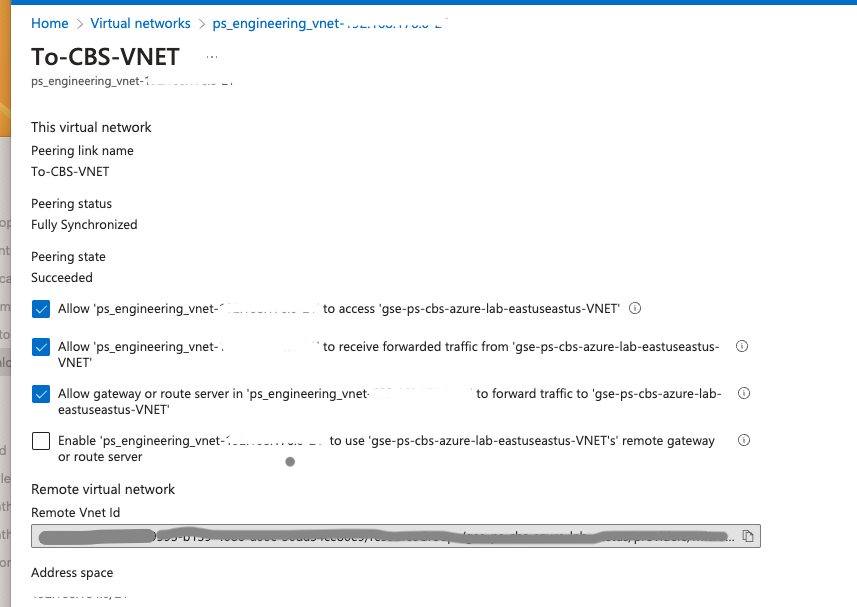
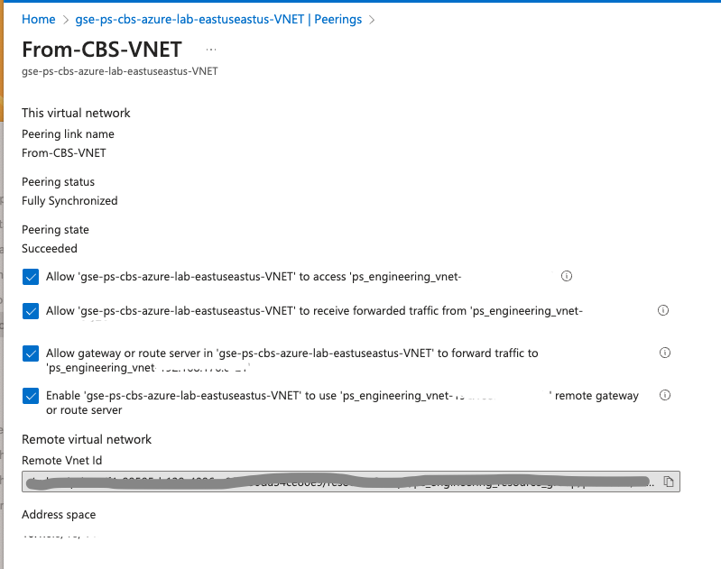

# Deploy CBS Into an Existing Azure Subscription with a specific resource group

By _Daniel Cave, Pure Storage, Global Services Engineering, March 2024_

## What does this code do

This terraform code will deploy a CBS Array into an existing Azure Resource Group which contains a Vnet and four subnets.

### If you want to route between your VNets from On Premise or another Azure subscription

Vis.

|  |
| :-------------------------------------------------------------: |

For testing purposes we used a /21 for each separate vnet and setup Vnet peer routing to allow On premise traffic access the CBS array from the management network via a site to site VPN (via the Virtual Network Gateway). You may already have this connectivity in place using another connection 

You may need to setup the Vnet peering between your managment and CBS vnet by uncommenting the Module CBS-VNet-Peering code in `main.tf` file on lines `144-152`, unless you have already done this.

The `Modules/CBS-VNet-Peering/main.tf`code has options to activate this which are commented out and setup the following traffic routing options in the Peering section in the Azure UI. These can be used by uncommenting lines`15-17 & 27-30`

|  |  |
| :------------------------------------: | :--------------------------------------: |
|                                     |                                       |

## How to Use

1. Deploy an Azure VM into the same subscription where you are planning to deploy CBS
2. Identify and obtain the names of the following resources.

- a resource group that you have created for CBS
- a VNET and four subnets that you want to use for CBS. Namely, system, management, iscsi and replication

This code will deploy the dependencies and CBS Array into the VNet which you choose along with the VNet peering between the Vnets.

3. SSH to your deployment VM (in step 1)
4. Clone this repository - if you haven't already
5. Change to this directory `cd Deploy-CBS-Existing-Infra`
6. Edit the `terraform.tfvars` file and modify all the variables required on lines:

   - Resource group name and region location `lines 2,3`
   - Existing Resource Group Name and Vnet  `lines 6 & 8`
   - Azure Client, Subscription and Tennant details `lines 11-14`
   - Azure Jump box VM username and password `lines 24,25`
   - CBS Version to deploy "Aka Plan name" `line 27` **This should be the latest version of CBS**
   -
7. Run `terraform init ; terraform plan` to check what is going to be deployed
8. Deploy the CBS dependencies and array using `terraform apply --auto-approve` to run with out human confirmation.
9. Grab a coffee for ~30mins
